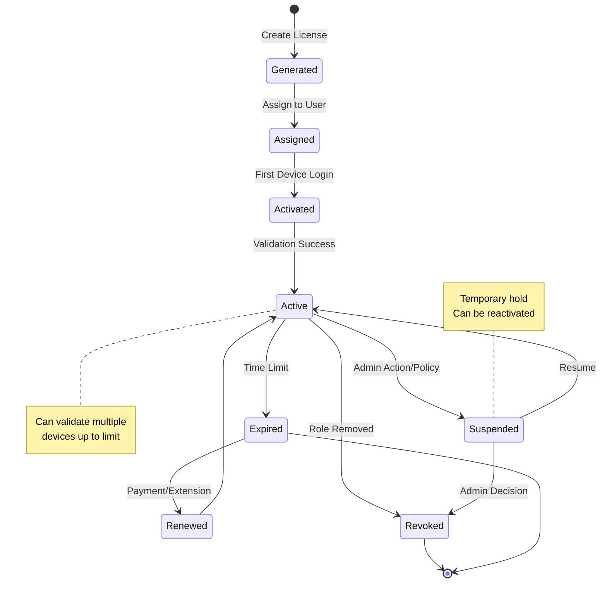

# DCA-Auth

**Discord-Connected Authorization System**

Enterprise-grade license key management system with Discord integration for automated role-based access control.

## System Overview

DCA-Auth is a comprehensive license key management platform that bridges Discord servers with external applications requiring authorization. The system automatically generates, distributes, and validates license keys based on Discord server roles, providing seamless integration between community management and software access control.

## Core Functionality

### License Key Management System

The license management system provides complete lifecycle control for software licenses:

| Function | Description | Technical Implementation |
|----------|-------------|-------------------------|
| **Key Generation** | Cryptographically secure license key creation | UUID v4 with custom encoding, checksums for validation |
| **Validation API** | Real-time license verification for external applications | REST endpoint with sub-50ms response time |
| **Bulk Operations** | Mass generation and revocation of licenses | Batch processing with transaction support |
| **Activation Tracking** | Monitor device activations per license | Device fingerprinting and limit enforcement |
| **Expiration Management** | Automatic handling of time-limited licenses | Background job processing with notification queue |

### Discord Integration Layer

Native Discord integration provides automated license distribution based on server roles:

| Component | Functionality | Architecture |
|-----------|---------------|--------------|
| **OAuth 2.0 Authentication** | Secure user authentication via Discord | Passport.js strategy with JWT session management |
| **Bot Command System** | Slash commands for license operations | Discord.js v14 with command builder pattern |
| **Event-Driven Automation** | Real-time role change detection | WebSocket event listeners with queue processing |
| **Guild Management** | Multi-server support with isolated configurations | Tenant isolation with guild-specific settings |
| **Role Synchronization** | Automatic license grant/revoke on role changes | Event-driven with eventual consistency model |

## System Architecture

### High-Level Architecture


### Service Interaction Model


## License Lifecycle Management

### State Machine



### Request Flow


## Authentication System

### OAuth Flow Implementation


## Data Architecture

### Entity Relationship Model


## API Specification

### REST Endpoints

#### Authentication Endpoints

| Method | Endpoint | Description | Authorization |
|--------|----------|-------------|---------------|
| POST | /auth/discord | Initiate Discord OAuth flow | None |
| POST | /auth/refresh | Refresh access token | Refresh Token |
| POST | /auth/logout | Invalidate session tokens | Bearer Token |
| GET | /auth/me | Retrieve current user profile | Bearer Token |

#### License Management Endpoints

| Method | Endpoint | Description | Authorization |
|--------|----------|-------------|---------------|
| GET | /licenses | List user's licenses | Bearer Token |
| POST | /licenses/validate | Validate license key | API Key |
| POST | /licenses/activate | Activate license on device | Bearer Token |
| DELETE | /licenses/:id/deactivate | Deactivate license | Bearer Token |
| GET | /licenses/:id/devices | List activated devices | Bearer Token |
| POST | /licenses/:id/transfer | Transfer license ownership | Bearer Token |

#### Administrative Endpoints

| Method | Endpoint | Description | Authorization |
|--------|----------|-------------|---------------|
| GET | /admin/users | List all system users | Admin Role |
| POST | /admin/licenses/generate | Bulk generate licenses | Admin Role |
| POST | /admin/licenses/revoke | Bulk revoke licenses | Admin Role |
| GET | /admin/analytics | System analytics data | Admin Role |
| GET | /admin/audit-log | Audit trail access | Admin Role |

### Webhook Events

The system publishes webhook events for integration with external systems:

```javascript
{
  "event": "license.activated",
  "timestamp": "2024-01-01T00:00:00Z",
  "data": {
    "licenseId": "uuid",
    "userId": "discord_id",
    "deviceId": "device_uuid",
    "metadata": {}
  }
}
```

Supported webhook events:
- license.created
- license.activated
- license.deactivated
- license.expired
- license.renewed
- license.revoked
- user.registered
- user.role_changed

## Technology Stack

### Core Infrastructure

| Layer | Technology | Purpose |
|-------|------------|---------|
| Runtime | Node.js 20.x | JavaScript runtime environment |
| Language | TypeScript 5.3 | Type-safe development |
| API Framework | Fastify 4.x | High-performance HTTP server |
| Database | PostgreSQL 15 | Primary data storage |
| ORM | Prisma 5.8 | Type-safe database access |
| Cache | Redis 7 | Session and data caching |
| Queue | BullMQ 5.x | Background job processing |
| Discord Bot | Discord.js 14 | Discord API integration |
| Frontend | Next.js 14 | React-based web dashboard |

### Security Implementation

| Security Layer | Implementation | Description |
|----------------|----------------|-------------|
| Authentication | OAuth 2.0 + JWT | Token-based authentication with refresh rotation |
| Authorization | RBAC | Role-based access control with permission hierarchy |
| Encryption | AES-256-GCM | Data encryption at rest for sensitive fields |
| Transport | TLS 1.3 | End-to-end encryption for all connections |
| Rate Limiting | Token Bucket Algorithm | Configurable per-endpoint rate limits |
| Input Validation | Zod Schemas | Runtime type validation for all inputs |
| SQL Injection Prevention | Prisma ORM | Parameterized queries with no raw SQL |
| XSS Protection | CSP Headers | Content Security Policy enforcement |
| CSRF Protection | Double Submit Cookie | Token validation for state-changing operations |

## Performance Characteristics

### System Metrics

| Metric | Specification | Implementation |
|--------|---------------|----------------|
| API Response Time | < 100ms p95 | Optimized query patterns with caching |
| License Validation | < 50ms p99 | Redis cache with fallback to database |
| Concurrent Users | 10,000+ | Horizontal scaling with load balancing |
| Requests/Second | 5,000+ | Connection pooling and async processing |
| Cache Hit Rate | > 90% | Multi-tier caching strategy |
| Database Connections | 100 pool size | PgBouncer connection pooling |

### Optimization Strategy


## Monitoring and Observability

### Health Check System

The platform provides comprehensive health monitoring endpoints:

| Endpoint | Purpose | Response |
|----------|---------|----------|
| /health | System health status | JSON health report |
| /metrics | Prometheus metrics | Time-series metrics |
| /ready | Readiness probe | Service availability |
| /live | Liveness probe | Process health |

### Metrics Collection

- Request latency histograms
- Database query performance
- Cache hit/miss ratios
- Discord API response times
- Background job queue depth
- License validation rates
- Error rate tracking
- Memory and CPU utilization

## Background Processing

### Job Queue System

| Job Type | Schedule | Purpose |
|----------|----------|---------|
| License Expiration Check | Every 1 hour | Deactivate expired licenses |
| Role Synchronization | Every 5 minutes | Sync Discord roles with licenses |
| Device Cleanup | Daily at 2 AM | Remove inactive devices |
| Analytics Aggregation | Every 15 minutes | Update analytics data |
| Notification Processing | Real-time | Send email/Discord notifications |
| Audit Log Rotation | Weekly | Archive old audit logs |

## Deployment Architecture

### Production Infrastructure


### Scaling Strategy

- Horizontal scaling for API servers
- Read replicas for database load distribution
- Redis cluster for cache distribution
- Queue workers auto-scaling based on job depth
- CDN for static asset delivery
- Database connection pooling for efficiency